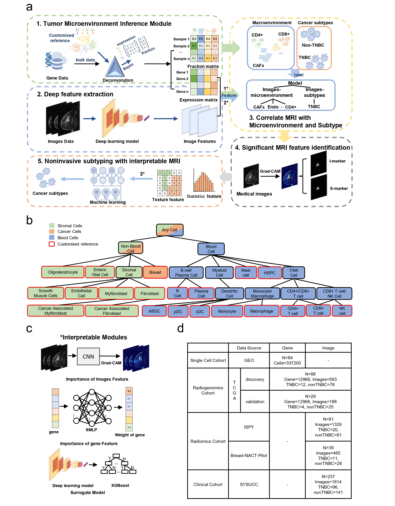

# noninvasive-tme-detection

# Project Title

Deep interpretable Radiogenomics Model Correlates MRI with TME for Noninvasive Cancer Subtyping

## Model architecture
The figure below shows the overview of the radiogenomics model in this repository.


## Getting Started

This project based on deconvolution method to obtain the cell type fraction and proportion from bulk data, and constructed the relationship of MRI with cancer subtypes/microenvironment based on deep radiogenomics model.

### Prerequisites

Model framework based on pytorch:  
Pytorch installation reference：  
https://pytorch.org/

#### Deconvolution
The BayesPrism requires the following installation packages in R：  
snowfall, NMF, gplots, scran, BiocParallel, Matrix  

Then BayesPrism installed as follows：
```
library("devtools");
install_github("Danko-Lab/BayesPrism/BayesPrism")
```
For more information about BayesPrism refer to https://www.nature.com/articles/s43018-022-00356-3 or https://github.com/Danko-Lab/BayesPrism

The methods Bisque, CIBERSORT, and xCell, quanTIseq, EPIC used for comparison are installed as follows：  
The xCell, quanTIseq, EPIC were constructed based on immunedeconv package:  
```
install.packages("remotes")
remotes::install_github("omnideconv/immunedeconv")
```
Reference:  
https://github.com/omnideconv/immunedeconv

CIBERSORT:  
```
install.packages("devtools")
devtools::install_github("Moonerss/CIBERSORT")
```
Bisque:  
```
install.packages("devtools")
devtools::install_github("cozygene/bisque")
```
#### Deep Radiogenomics
MRI convert to JPG/PNG from DICOM based on pydicom：  
```
pip install pydicom
```
Radiomics features extract by Pyradiomics:
```
pip install pyradiomics
```

## Running the Model
### Model
**Run the BayesPrism by**:  
./Code/R/bayes_scATOMIC8_BRCA.Rmd  
  
**Run the other deconvolution methods**：  
Bisque： ./Code/R/bayes_bisque_BRCA.Rmd  
CIBERSORT：./Code/R/Cibersort.R  
Other: ./Code/R/immunedeconv_all.R  
  
**Run the deep radiogenomics model by**:  
./Code/train_model.py  
  
**Obtain the image marker by**:  
Radiogenomics discovery and validation cohort (with gene): ./Code/Grad_CAM.py  
Radiomics cohort and clinical cohort (without gene): ./Code/validation_marker.py  
  
**Important features of SMLP**:  
./Code/Important_feature.py  
  
**Extract radiomics feature**:  
./Code/radiomics_feature.py  
  
**Surrogate Model (XGB)**:  
./Code/val_surrogate.ipynb

### Analysis
**The GSEA**：  
./Code/R/GSEA.R  

**Heat map and PCA of Figure2**:  
./Code/R/Heatmap_and_PCA.R  

**Boxplot of Figure2**:  
./Code/R/boxplot.R  


## Contributing

Please read [CONTRIBUTING.md](https://gist.github.com/PurpleBooth/b24679402957c63ec426) for details on our code of conduct, and the process for submitting pull requests to us.

## Authors

* **xxx** - *Initial work* - [PurpleBooth](https://github.com/PurpleBooth)

See also the list of [contributors](https://github.com/your/project/contributors) who participated in this project.

## License

This project is licensed under the MIT License - see the [LICENSE.md](LICENSE.md) file for details

## Acknowledgments

* Hat tip to anyone whose code was used
* Inspiration
* etc


### contribution


### Author

